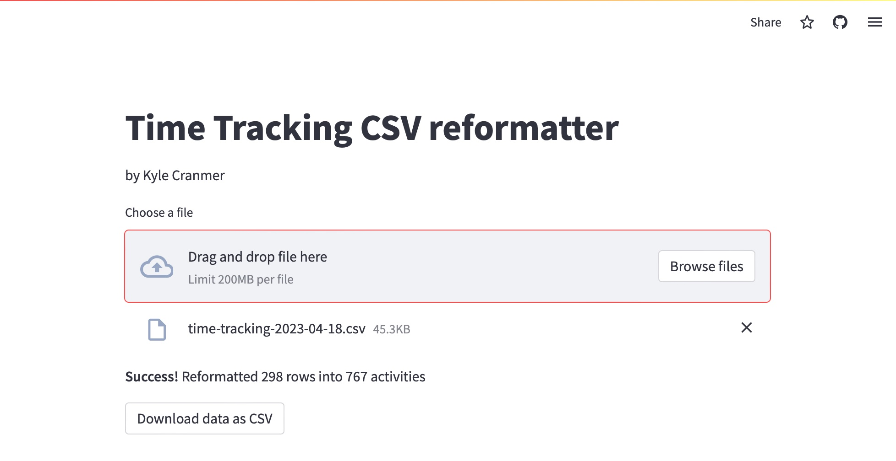
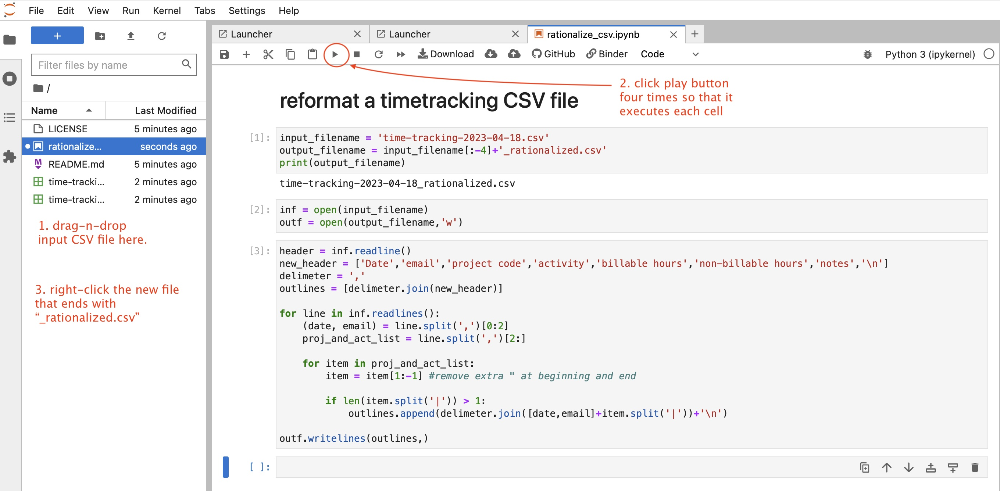

# Timesheet CSV rationalizer

A little project with a simple CSV reformatting task. Using this to test out different ways to deploy simple tools using web-services.

## Streamlit App

[https://cranmer-timesheet-csv-rationalizer-streamlit-app-0l9eh5.streamlit.app/](**Launch App**)

## Binder / Jupyter Hub version (can edit code if needed)
Click on the badge below to run this notebook in the cloud with zero install. You should be able to upload an input CSV file and change the input filename in the code.

